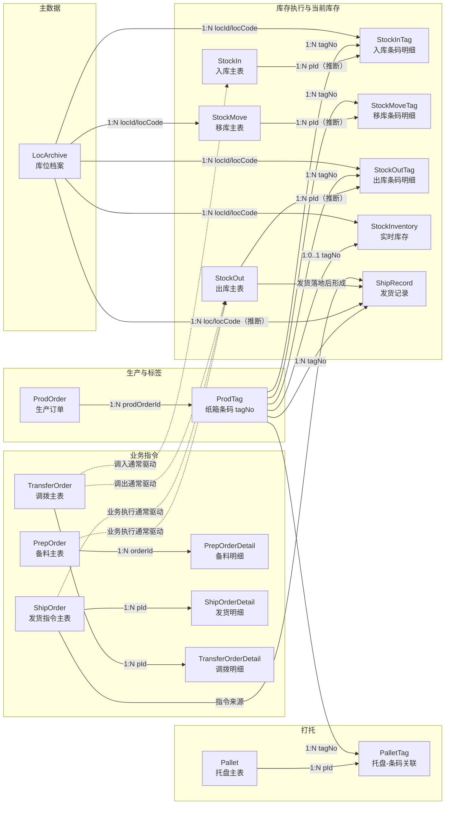

# 数据库 ER 图

说明：这份 ER 图仅基于 [db.sql](D:/code/java/hz-xg/db.sql) 梳理，没有读取其他代码文件。  
另外，库里几乎没有 `FOREIGN KEY`，所以图中的大部分连线是根据字段名、索引和表职责推断出的逻辑关系，不是数据库硬约束。

## 关键说明

- `ProdTag.tagNo` 是整套 WMS 里最核心的追踪键，库存和扫码动作基本都围绕它展开。
- `StockInventory` 表示当前态库存；`StockIn`、`StockMove`、`StockOut`、`ShipRecord` 更偏过程记录和历史记录。
- `Pallet` 是容器，真实货物最小粒度仍然是 `tagNo`。
- `PrepOrder`、`ShipOrder`、`TransferOrder` 更像业务指令单，和库存执行之间主要是逻辑关系，不是数据库外键约束。
- `StockInTag.pId`、`StockOutTag.pId` 的注释疑似有复制痕迹，实际更可能分别关联 `StockIn.id`、`StockOut.id`。
